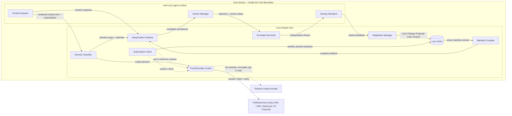

# LensPub Architecture

**Status:** Draft v0.1 · **Date:** 2026-07-09 · **License:** CC-BY 4.0

This document defines the reference architecture for LensPub: where interpretation executes, the engine-agnostic decomposition of a conforming implementation into components, the layout and mobility of data at rest, the mapping of those components onto a browser extension and onto other user agents, the interoperability seams at which independent implementations meet, and the performance and failure behavior an implementation is expected to exhibit. It is normative where it constrains observable behavior and interchange, and descriptive where it names internal structure that implementations are free to rearrange.

The key words MUST, MUST NOT, REQUIRED, SHALL, SHALL NOT, SHOULD, SHOULD NOT, RECOMMENDED, NOT RECOMMENDED, MAY, and OPTIONAL in this document are to be interpreted as described in BCP 14 [RFC 2119] [RFC 8174] when, and only when, they appear in all capitals.

## 1. Where interpretation executes

Interpretation is a **user-agent-side, post-render overlay stage** ([ADR-0008](../adr/0008-interpretation-is-overlay-stage.md)). Precisely: interpretation executes on the user's device or user agent, *after* the document has been rendered, operating on the rendered document — the DOM and the accessibility tree, or more generally any **rendered-content tree** the host user agent exposes — and produces Overlay Annotations that sit visually and semantically above the content without mutating it. Interpretation is not a network layer, not a rewriting proxy, and not a build step. The "interpretation layer" phrasing used in vision documents is conceptual framing for exactly this stage.

This operating point is a decision, not an accident, and the rejected alternatives recorded in ADR-0008 explain the shape of everything that follows:

- **A literal new web layer** was rejected as technically indefensible: the web's layering mixes network and document concerns, and a loose layer claim would not survive standards review. LensPub claims a stage *in the user agent*, not a stratum of the stack.
- **Proxy or middlebox interpretation** — interposing a server between the user and the origin — was rejected because it violates local-first design ([ADR-0005](../adr/0005-local-only-default.md)) and creates precisely the centralized observation point LensPub exists to oppose. A middlebox sees every page every subscriber reads.
- **Build-time or publisher-side interpretation** was rejected because it returns control of interpretation to publishers, which is the opposite of the project's thesis. Publishers already control content and presentation; interpretation is the reader's.

Executing after render, on the user's side of every trust boundary, pins the trust story: by default nothing the user reads, and nothing about how the user interprets it, leaves the device. It also fixes the integration contract — a Lens Engine needs a rendered-content tree and a way to draw above it, nothing deeper — which is what lets the same architecture generalize beyond the browser (Section 5).

Because interpretation operates on the accessibility tree as well as the DOM, overlays MUST be exposed to assistive technologies as first-class annotations and MUST NOT degrade the accessibility of the underlying content (ADR-0008).

## 2. Reference component decomposition

This section decomposes a conforming implementation into eleven named components. The decomposition is engine-agnostic: it holds whether the Lens Engine is rule-based, local-model, hosted-model, or hybrid — the [capability tiers](../GLOSSARY.md#capability-tier) of [ADR-0004](../adr/0004-reproducibility-envelope.md). Component boundaries here are descriptive; only the interchange objects and operations in Section 6 are protocol-normative. Implementations MAY merge or split components freely provided observable behavior is preserved.

**Content Acquirer.** Integrates with the host user agent to obtain the rendered-content tree — in a browser, the DOM and accessibility tree of the loaded document — and to observe changes to it (mutations, navigation, viewport movement). The Content Acquirer is read-only with respect to content: it snapshots and watches, it never edits. It also computes the `contentHash` of the rendered text used for drift detection and caching (see the `target.contentHash` field of [interpretation-result.schema.json](../schemas/interpretation-result.schema.json)).

**Domain Classifier.** Assigns content to the Domain Scopes declared in the active Lens Manifest. Classification is an engine responsibility and MUST be explainable ([Glossary: Domain Scope](../GLOSSARY.md#domain-scope)): the classifier's output is a scope identifier *plus* the human-readable basis for the assignment, which flows into Reasoning Traces and into the Trust Boundary Guard's per-domain opt-in checks. A rule-based tier may classify by origin lists and keywords; a model tier may classify semantically; either way the user can see why a page was treated as "politics."

**Manifest Compiler.** Compiles the declarative, model-agnostic Lens Manifest into whatever engine-internal artifacts the engine needs — rules, prompts, retrieval configuration, classifier thresholds ([ADR-0001](../adr/0001-manifest-is-declarative-policy.md)). Compiled artifacts are never exchanged and never persisted as if they were the lens; the manifest remains the single source of truth, and recompilation from a given manifest version MUST be possible at any time.

**Interpretation Pipeline.** Executes compiled interpretation policy against acquired content and produces candidate Overlay Annotations with Reasoning Traces. The pipeline's internal stages differ by capability tier — a rule-based engine pattern-matches, a local-model engine runs staged inference, a hybrid engine does both — but its contract is fixed: content plus compiled policy in; annotations with reasoning and `manifestRefs` out. The pipeline consults the Trust Boundary Guard before any step that would leave the device.

**Anchor Manager.** Produces W3C Selectors (`TextQuoteSelector`, `TextPositionSelector`, `CssSelector`, `RangeSelector`, `XPathSelector`) for each annotation, most specific first, and performs robust re-anchoring when content shifts, per the profile of the [W3C Web Annotation Data Model](https://www.w3.org/TR/annotation-model/) defined in [ADR-0002](../adr/0002-profile-web-annotation.md). On anchoring failure it degrades per the robust-anchoring strategy in the [Lens Engine specification](../spec/lens-engine.md) and records the outcome in the annotation's `anchor.status` (`exact`, `degraded`, `unanchored`, or `document`). It MUST NOT guess-anchor silently.

**Overlay Renderer.** Draws Overlay Annotations above content. In browsers, the renderer MUST isolate its UI from the page — Shadow DOM roots with isolated styles are the reference technique — so that page CSS cannot restyle overlays and page scripts cannot trivially forge or tamper with them. The renderer MUST integrate with the accessibility tree: overlays carry appropriate ARIA roles and labels, are reachable by assistive technology, and never obscure, reorder, or re-describe the underlying content's accessible structure (ADR-0008). The renderer also visibly distinguishes degraded and unanchored annotations (ADR-0002) and local versus remote provenance of results (ADR-0005).

**Envelope Recorder.** Assembles the final Interpretation Result: annotations plus the mandatory Reproducibility Envelope recording engine identifier and version, capability tier, execution location (`local` or `remote`, with the authorizing `optInScope` when remote), model identifier and hash where obtainable, generation parameters, and prompt-template identifier ([ADR-0004](../adr/0004-reproducibility-envelope.md)). Every result MUST carry an envelope; the recorder is the component that makes drift visible rather than silent.

**Adaptation Manager.** Turns explicit user feedback into evidence, and accumulated evidence into Lens Change Proposals, under the manifest's Adaptation Policy parameters (`proposalFrequency`, `evidenceThreshold`, `autoAcceptCeiling`; [ADR-0010](../adr/0010-adaptation-policies-parameterized.md)). It runs shadow evaluations, presents proposals for user review, and — this is a hard boundary — **owns all private Adaptation State**: feedback records, pending proposals, evaluation data. No other component reads or exports that state ([ADR-0006](../adr/0006-history-free-shareable-core.md)).

**Lens Store.** Persists Lens Manifest versions as immutable, content-addressed snapshots (version plus hash, per the manifest's `versionHistory`), including pinned copies of subscribed Published Lenses. Rollback to any prior version MUST be supported. The store holds manifest cores only; it never holds Adaptation State or Interpretation Results.

**Subscription Client.** Resolves a subscribed lens identifier (URL or DID) to a manifest, fetches it, verifies any Data Integrity proof and publisher DID per [ADR-0003](../adr/0003-adopt-vc2-dids-for-trust.md) and the [Security Model](../security/security-model.md), and pins the verified version into the Lens Store. Updates to tracked subscriptions surface as reviewable proposals, never as silent replacement.

**Trust Boundary Guard.** The single enforcement point for [ADR-0005](../adr/0005-local-only-default.md). All outbound flows pass through it. For remote inference it checks the manifest's `privacy.remoteInference` settings against the Domain Classifier's scope decision before any content excerpt, manifest, or adaptation state leaves the device; absent an active per-domain opt-in, nothing crosses. It records every authorized crossing so the Envelope Recorder can attest `execution.location` and `optInScope`, honors revocation immediately, and fails closed (Section 8). Subscription traffic also transits the Guard so that all network activity of the engine is observable in one place.

### 2.1 Component diagram

The trust boundary is the device edge. The only flows that cross it are subscription fetches (public manifests in, lens identifiers out) and — solely under an active per-domain opt-in — remote inference. Everything else, including all content, all Adaptation State, and all Interpretation Results, stays inside.

## 3. Data at rest and mobility

A LensPub implementation persists three classes of data with deliberately different mobility, following [ADR-0006](../adr/0006-history-free-shareable-core.md):

| Data | Owner component | Mobility class | May leave the device? |
|---|---|---|---|
| Manifest core (all versions, content-addressed) | Lens Store | Shareable | Yes — publish, export, subscribe, diff |
| Adaptation State (feedback, pending proposals, evaluation data) | Adaptation Manager | Private, user-syncable | Only between the user's own devices, end-to-end encrypted |
| Interpretation Results (per-page annotations, envelopes, caches) | Envelope Recorder / device cache | Device-local | No |

The **manifest core** is the only shareable object. It is history-free by schema construction ([lens-manifest.schema.json](../schemas/lens-manifest.schema.json), under the provisional namespace `https://lenspub.org/ns/`): it MUST NOT contain URLs visited, content excerpts, reading timestamps, or feedback records. Publishing, exporting, and Lens Diff all operate on manifest cores exclusively.

**Adaptation State** is private and device-local. It MAY synchronize between a user's own devices, and any such sync MUST be end-to-end encrypted so that no intermediary — including a sync provider operated by an engine vendor — can read it (ADR-0006). To be honest about scope: **v0.1 does not specify a sync protocol.** The requirement is on the property (E2E encryption, user's-own-devices only), not the mechanism; implementations choose their own transport, and a standardized sync profile is roadmap material ([../docs/roadmap.md](../docs/roadmap.md)).

**Interpretation Results** are device-local by construction: they reference what the user read (`target.source`, `contentHash`) and are therefore reading history. They are a regenerable cache — any result can be reproduced from the manifest version, the content, and the engine — so implementations SHOULD treat them as disposable and need not sync them; an implementation that does sync them MUST apply at least the same end-to-end encryption required of Adaptation State.

## 4. The browser embodiment

The reference implementation ([reference-implementation.md](reference-implementation.md), code under [`/poc`](../poc/)) targets a Manifest V3 (MV3) browser extension. The component-to-surface mapping is:

| Component | Extension surface |
|---|---|
| Content Acquirer | Content script (per-tab) |
| Anchor Manager | Content script (DOM-adjacent re-anchoring) |
| Overlay Renderer | Content script (Shadow DOM roots; ARIA integration) |
| Domain Classifier, Manifest Compiler, Interpretation Pipeline (orchestration), Envelope Recorder, Adaptation Manager | Extension service worker (engine host) |
| Lens Store, Adaptation State storage | Service worker over IndexedDB / `chrome.storage` |
| Subscription Client, Trust Boundary Guard | Service worker (sole holder of network permissions) |
| Local model execution | WebGPU runtime in an offscreen document, or a native-messaging companion process |

The **content script** is the host-UA integration: it acquires the DOM and accessibility tree, computes content hashes, re-anchors on mutation, and renders overlays inside isolated Shadow DOM roots so page styles and scripts cannot interfere with — or counterfeit — lens UI. The **service worker** hosts the engine proper and is the only surface with network access, which makes the Trust Boundary Guard's single-enforcement-point property structurally checkable. Because MV3 service workers cannot hold a WebGPU context across their lifetime, a **local model** runs either in an offscreen document hosting a WebGPU runtime (WebLLM-class, for the local-model tier) or in a native-messaging companion process when the user wants models larger than in-browser runtimes support; both remain on-device and inside the trust boundary.

Two MV3 constraints deserve mention because they *align* with LensPub's security posture rather than fighting it. First, MV3 prohibits remotely hosted code: every executable artifact ships in the reviewed extension package. LensPub requires the same property at the protocol level — a Lens Manifest is declarative data, never code and never a prompt ([ADR-0001](../adr/0001-manifest-is-declarative-policy.md)), so subscribing to a lens can never import executable behavior. Second, MV3 service workers are short-lived and evicted aggressively. This forces the engine host to be stateless between events, persisting everything durable to the Lens Store and Adaptation State storage — which is exactly the crash-consistent, resumable design the failure-mode requirements of Section 8 demand anyway. The offscreen document exists precisely to give long-running local inference a lifetime the service worker cannot provide.

## 5. Beyond the browser

ADR-0008's definition deliberately generalizes: interpretation attaches to any user agent that exposes a rendered-content tree. The decomposition of Section 2 carries over; only the Content Acquirer, Anchor Manager, and Overlay Renderer — the host-UA surface — are re-bound per embodiment.

**E-reader.** The rendered-content tree is the rendered EPUB content document (XHTML) of the current spine item, plus the reader's pagination model. The Content Acquirer hooks the reading system's rendering layer; the Anchor Manager's text-quote and position selectors apply directly to the content document, with pagination handled as a presentation concern; the Overlay Renderer draws margin annotations and inline indicators in the reader's chrome. Long-form, stable text makes this the *easiest* anchoring environment LensPub targets.

**Feed client.** The rendered-content tree is the set of rendered entry trees (posts, articles) in a timeline. Interpretation runs per entry as entries materialize; viewport-priority scheduling (Section 7) matters most here because entries arrive faster than any engine tier can interpret them. Subscriptions and feed transport may even share substrate — AT Protocol is LensPub's reference subscription binding — but the interpretation stage remains strictly client-side.

**OS-level agent.** The rendered-content tree is the platform accessibility tree itself (UI Automation, AT-SPI, or the macOS accessibility API), which is the one uniform post-render representation the OS already maintains across applications. The Content Acquirer is an accessibility-API client; the Overlay Renderer draws in a system overlay layer. This is the "system-wide interpretation" direction the constitution reserves for later; it is roadmap material, not v0.1 scope — see [../docs/roadmap.md](../docs/roadmap.md).

In every embodiment the invariants are identical: post-render, on-device by default, overlay-not-rewrite, envelope on every result.

## 6. Interoperability seams

Multiple independent implementations MUST interoperate at the seams and only at the seams. The protocol-normative surface is deliberately small:

- **The three exchange objects**, normative by schema: [Lens Manifest](../schemas/lens-manifest.schema.json) (`application/lens-manifest+json`, provisional), [Lens Diff](../schemas/lens-diff.schema.json) (`application/lens-diff+json`, provisional), and [Interpretation Result](../schemas/interpretation-result.schema.json). A conforming implementation MUST consume and produce these objects as specified in the [protocol specification](../spec/lenspub-protocol.md) and the schemas, including the Web Annotation selector profile (ADR-0002) and the Reproducibility Envelope (ADR-0004).
- **Subscription operations**: resolve, fetch, verify, and pin, with signature verification per [ADR-0003](../adr/0003-adopt-vc2-dids-for-trust.md) and [W3C VC Data Integrity](https://www.w3.org/TR/vc-data-integrity/), as defined in the protocol specification.
- **The behavioral requirements** attached to those objects: anchoring degradation semantics, adaptation-policy parameter semantics (ADR-0010), and trust-boundary rules (ADR-0005).

Everything else in Section 2 is implementation-internal. The Manifest Compiler, Domain Classifier, and Interpretation Pipeline are explicitly *not* interoperability surfaces: two engines given the same manifest may compile differently, classify by different techniques, and produce different annotations — that is the capability-tier bargain of ADR-0004, which guarantees portability of the manifest, not of the experience. What every engine owes in return is the same: explainable classification, reasoning traces, honest envelopes, and schema-valid results. An implementation that reproduces the seams interoperates; one that reproduces this document's internal boxes but violates a seam does not.

## 7. Performance and resource considerations

Interpretation is an enrichment of reading, not a gate on it. Concretely:

- Interpretation MUST NOT block rendering, navigation, or interaction of the underlying content. The page loads, paints, and behaves exactly as it would without LensPub; overlays arrive when they arrive.
- Interpretation latency SHOULD be perceptually secondary: overlays appearing within a few seconds of settle are acceptable; jank, delayed first paint, or blocked scrolling are not. The Content Acquirer SHOULD observe content passively (mutation observers, idle callbacks) rather than polling.
- Engines SHOULD interpret incrementally and viewport-first: visible content before off-screen content, cheap signals (source trust, provenance presence — effectively rule-tier output) before expensive ones (summaries, counterpoints), so that useful overlays appear early even when model inference is slow.
- Results SHOULD be cached keyed by (`target.contentHash`, lens version, envelope-relevant engine identity) and reused on revisit; a changed `contentHash` invalidates the entry and doubles as content-drift detection.

Local models have costs the specification refuses to hide: sustained on-device inference consumes battery, raises thermals, and competes for memory with the host user agent — materially so on laptops and severely so on phones. This is precisely why capability tiers exist (ADR-0004). A conforming engine on constrained hardware SHOULD degrade tier rather than degrade the device: fall back to rule-based interpretation, defer model passes to idle or charging periods, or reduce interpretation depth. The one thing it MUST NOT do is quietly route to a remote model to compensate — that path exists only through the Trust Boundary Guard under an explicit opt-in (ADR-0005). Users on hardware that cannot run useful local models can choose remote inference; the choice is theirs, per domain, and visible in every envelope.

## 8. Failure modes

A LensPub implementation fails toward the reader's normal experience, never away from it.

**Engine unavailable.** If the Lens Engine crashes, is disabled, or cannot start, the underlying page MUST be entirely unaffected — fully readable and interactive with no overlays. Interpretation is additive by construction (Section 1); its absence is the absence of annotations, nothing more.

**Remote engine unavailable or opt-in revoked.** When a remote model is unreachable, errors, or its opt-in has been revoked, the engine MUST fail *closed* into local capability — local-model or rule-based interpretation, or no interpretation — and MUST NOT silently substitute a different remote service ([ADR-0005](../adr/0005-local-only-default.md)). The Trust Boundary Guard enforces this; results produced during the fallback carry envelopes attesting `location: "local"`, so the degradation is visible rather than mysterious.

**Anchoring failure.** When content has shifted such that no selector matches exactly, the Anchor Manager degrades per [ADR-0002](../adr/0002-profile-web-annotation.md): attach at the nearest stable ancestor or present the annotation unanchored in a margin panel, with `anchor.status` set to `degraded` or `unanchored` and the Overlay Renderer marking it visibly. Silent guess-anchoring is prohibited; a misplaced annotation is worse than an honestly displaced one.

**Subscription fetch failure.** When a subscribed lens cannot be resolved, fetched, or verified, the engine MUST continue with the last successfully verified, pinned version from the Lens Store and surface the staleness to the user. A verification *failure* on fetched content (bad proof, revoked publisher) is treated as security-relevant per the [Security Model](../security/security-model.md), not merely as staleness — the fetched manifest is discarded, and the pinned version remains in effect.

In all four cases the system's floor is the same: the unmodified page, the user's last-known-good lens, and an honest indication of what is degraded and why.
