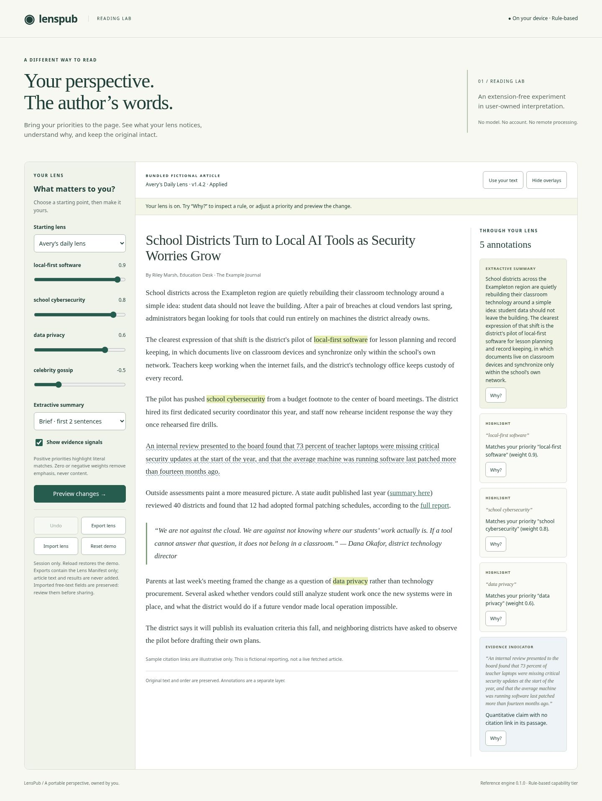

# Reading Lab validation

Validated on 2026-10-08 in the isolated cloud checkout, based on commit `a553c3c482860d11de2690b5005740a24043f8a8`. Runtime: Node 24.19.0, Playwright 1.55.1, system Chromium 151.0.7922.173. Other browser engines have not been tested. CI retains the existing Node 18/22 matrix and adds a Chromium browser job with screenshot artifacts.

| Check | Result |
|---|---|
| `npm test` | 33 passed, 0 failed |
| `npm run validate` | 11 examples valid, 3 counter-examples rejected |
| `npm run check-links` | All repository relative links resolve |
| `npm run conformance` | 35 passed, 0 failed, 26 explicitly skipped |
| `npm run conformance:self-test` | 15 passed, 0 failed |
| `CHROMIUM_PATH=/usr/bin/chromium npm run test:browser` | 16 scenarios passed |
| Extracted runnable ZIP in Chromium | 5 initial annotations, no JavaScript errors |
| `git diff --check` | Passed |

The [browser suite](../test/reader-browser.mjs) exercises actual DOM/UI behavior: keyboard Why/Escape and focus restoration, a skip link, keyboard sliders, nonmutating preview, apply/undo/cancel, twelve repeated lens switches, hide/show, import/export round trip, malformed/oversized/history-bearing/canceled imports, deliberately delayed stale file reads, canceled/blank text input, inert script/image-like pasted text, reset/reload, and a 390-pixel mobile viewport without horizontal overflow.

It compares the article's complete `innerHTML` before and after overlay and lens operations; checks no user-supplied script/image elements were created; records zero runtime external requests and browser errors; and verifies empty local/session storage. The static host also rejects traversal and non-asset paths. The exported manifest contains no application-added article text, annotation result, or visited-URL fields. Arbitrary history embedded in imported free text is not detected by the existing validator.

The CSS Highlight API leaves source DOM nodes untouched. Preview lists intended annotation outputs and changed topic weights without altering the applied reading view. The manual edit workflow does not claim protocol Lens Change Proposal or Lens Diff conformance. The engine's existing unsupported conformance roles remain skipped.

## Screenshots

[Desktop reader](screenshots/desktop.jpg) · [Mobile reader](screenshots/mobile.jpg) · [Why explanation](screenshots/why.jpg)

## Run and reproduce

See the [Reading Lab instructions](README.md). `npm run demo` starts the loopback preview. `npm run demo:package` creates a standalone runnable ZIP without runtime npm dependencies. The delivered package additionally contains these three screenshots and the browser test log under `evidence/`.
